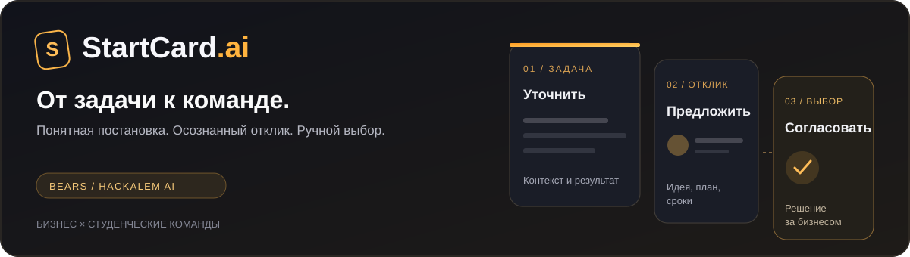

<p align="center">
  
</p>

# StartCard.ai

**Платформа, которая превращает короткую бизнес-задачу в понятную карточку и помогает выбрать студенческую команду.**

[Быстрый запуск](#быстрый-запуск) · [Проверка проекта](#проверка-для-команды-и-жюри) · [Документация](docs/README.md) · [API](docs/api-contract.md) · [Разработка](CONTRIBUTING.md)

| Команда | Трек | Кейс в материалах команды |
|---|---|---|
| **bears** | **07 — Образование** | **AI Sana Challenge Hub: от бизнес-задач к решению** |

Байбусин Кайдар · Бейбитов Санжар · Ескендиров Масуд

Название трека и кейса взято из предварительных материалов и README команды. Полное официальное ТЗ в репозитории отсутствует. AI-подбор и ранжирование команд остаются расширением идеи и пока не реализованы.

## Зачем нужен продукт

Бизнесу сложно получить подходящий результат, если задача описана одной фразой. Студентам нужны понятные данные, ограничения и критерии приёмки перед откликом. StartCard.ai помогает уточнить постановку, проверить карточку и собрать предложения. Экономия времени и качество подбора пока не измерялись.

**Бизнес:** описывает задачу → отвечает на вопросы → проверяет карточку → публикует → рассматривает отклики.
**Студент:** создаёт профиль → выбирает задачу → предлагает решение → получает уведомление о решении бизнеса.

## Возможности

| Область | Что можно сделать |
|---|---|
| Профили | Создать, выбрать и отредактировать профиль студента или бизнеса. ID и роль сохраняются |
| Конструктор | Получить уточняющие вопросы, сформировать и отредактировать карточку перед публикацией |
| Готовность задачи | Посмотреть рейтинг 0–100 и разбивку по семи полям; рейтинг пересчитывается при редактировании |
| Каталог | Искать задачи, фильтровать по теме и готовности, отправлять предложения |
| Кабинет бизнеса | Видеть задачи выбранного профиля и поступившие на них отклики, принять или отклонить команду |
| Уведомления | Бизнесу — новый отклик; студенту — принятие или отклонение. Счётчик непрочитанных, отметка прочтения, переход к событию |
| Сохранение | Профили, задачи, отклики, решения и уведомления сохраняются на сервере после обновления страницы и перезапуска |

Профили работают **без паролей и авторизации**. Это открытый демонстрационный режим: любой посетитель может выбрать существующий профиль. Он не предназначен для приватных данных.

Рейтинг отражает заполненность описания по правилам. Он не проверяет достоверность сведений и не является оценкой команды моделью.

## Быстрый запуск

Нужны **Git, Node.js 22.12+ (рекомендуется Node.js 24 LTS) и npm**. Проверки выполняются из корня репозитория.

```sh
git clone --branch main https://github.com/BAITC-Hacks/hack-97e25780-bears.git
cd hack-97e25780-bears
npm ci
```

Создайте локальный файл настроек — PowerShell:

```powershell
Copy-Item .env.example .env
```

Для macOS/Linux: `cp .env.example .env`. Ключи можно оставить пустыми.

```sh
npm run dev
```

Откройте **http://localhost:3000**. UI и API работают на одном адресе. Терминал оставьте открытым; остановка — `Ctrl+C`.

<details>
<summary><strong>Запуск собранной версии и отдельно API</strong></summary>

```sh
npm run build
npm start
```

`npm start` требует папку `dist/`. Установка должна включать devDependencies: launcher использует `tsx`, поэтому `npm ci --omit=dev` для этой версии не подходит.

Только API: `npm run start:api`. Не запускайте его одновременно с общим сервером на том же порту.

</details>

Проверка сервера: **http://localhost:3000/health**. В PowerShell:

```powershell
Invoke-RestMethod http://localhost:3000/health
```

При обычном запуске без ключей ожидаются `status: "ok"`, `storage: "file"`, `aiConfigured: false` и оба `aiProviders` равные `false`.

## Профили и уведомления

- Нажмите блок профиля в боковом меню. Можно выбрать существующий профиль, создать новый или изменить текущий.
- У студента доступны имя, команда, вуз, специализация, навыки и контакты; у бизнеса — имя представителя, компания и должность.
- Сервер выдаёт постоянный ID. Изменение имени не разрывает связь с задачами и откликами.
- При отправке отклика уведомление получает профиль, опубликовавший задачу. При принятии или отклонении — профиль студента.
- Колокольчик показывает фактическое число непрочитанных. Прочитать можно отдельное событие или весь список.
- Уведомления и данные обновляются периодически и при возвращении к вкладке. Email, Telegram-рассылок и браузерных push-уведомлений нет.

Профили общие для запущенного сервера. Выбранный профиль запоминается в браузере, поэтому две вкладки можно использовать для проверки разных участников. Не вводите номер студенческого билета, пароль или другие приватные сведения: ID создаётся автоматически.

## Хранение данных

По умолчанию сервер создаёт **`data/runtime/startcard.json`**. Профили, карточки, отклики, решения и уведомления восстанавливаются из этого файла при следующем запуске. Каталог `data/runtime/` исключён из Git.

- Для резервной копии остановите сервер и скопируйте файл в отдельное место.
- `DATA_FILE` позволяет выбрать другой путь; относительный путь отсчитывается от корня проекта.
- `DATA_FILE=:memory:` включает временный режим: после перезапуска данные исчезают, `/health` показывает `storage: "memory"`.
- Файл рассчитан на **один серверный процесс**. На хостинге нужен постоянный диск; для нескольких экземпляров сервера потребуется общая БД.
- При повреждённом файле сервер сообщает ошибку. Он не должен незаметно заменять пользовательские данные учебным примером.

Черновик до публикации, закладки и демонстрационный раздел поиска команд остаются локальными состояниями интерфейса.

## Переменные окружения и AI

Настройки читаются сервером из `.env` рядом с `package.json` либо из окружения хостинга. После изменения перезапустите процесс.

| Переменная | Назначение | Значение в примере |
|---|---|---|
| `PORT` | Общий порт UI и API | `3000` |
| `CORS_ORIGIN` | Origin отдельного клиента API | `http://localhost:3000` |
| `DATA_FILE` | Локальное хранилище | `data/runtime/startcard.json` |
| `GEMINI_API_KEY` | AI-вопросы и карточка в текущем UI | Пусто, необязательно |
| `GEMINI_MODEL` | Модель конструктора | `gemini-flash-latest` |
| `GEMINI_TIMEOUT_MS` | Таймаут Gemini | `10000` |
| `OPENAI_API_KEY` | Отдельные API уточнений, не вызываемые текущим UI | Пусто, необязательно |
| `OPENAI_MODEL` | Модель отдельного сервиса | `gpt-4o-mini` |
| `OPENAI_TIMEOUT_MS` | Таймаут OpenAI | `10000` |

**Для настоящего AI в конструкторе нужен Gemini-ключ. Один OpenAI-ключ не включает AI в этом интерфейсе.** Модель можно заменить на доступную вашему аккаунту. Флаги `/health` подтверждают наличие настройки, но не доступ к модели или квоту.

Без ключа, при таймауте или ошибке провайдера интерфейс обозначает резервный режим: сервер задаёт вопросы по правилам и переносит введённые ответы в поля. Неизвестные сведения остаются пустыми. Каталог, профили, отклики и уведомления работают без AI-ключа.

`.env.example` содержит только пустые ключи; `.env` исключён из Git. Не помещайте секреты в React, переменные `VITE_*`, клиентскую сборку или commits. Ключи из переписки не используются; ранее опубликованный ключ следует отозвать у провайдера.

Реальный успешный запрос к Gemini/OpenAI при проверках без ключей **не подтверждён**. Тесты AI-сервисов используют подставные клиенты для успешного ответа, ошибки и таймаута.

## Проверка для команды и жюри

1. Запустите приложение. В режиме **«Бизнес»** откройте профили и создайте `Учебная столовая` с тестовым именем представителя. Отредактируйте должность и сохраните.
2. Нажмите **«Создать Карту + ИИ»**. Пустой черновик должен вызвать ошибку. Затем введите: `Нужен сервис прогноза очередей в столовой кампуса для студентов и сотрудников.`
3. Получите вопросы. Без ключа проверьте подпись резервного режима. Ответьте: данные — обезличенный CSV; приёмка — прогноз пиковых часов на контрольной неделе; срок — две недели; куратор — `demo@example.com`; пользователи — студенты; результат — веб-прототип и инструкция.
4. Сформируйте карточку. Измените название, проверьте перенесённые ответы. Удалите и восстановите одно поле: рейтинг должен пересчитаться. Подтвердите публикацию.
5. В режиме **«Студент»** создайте свой профиль с названием команды. Найдите опубликованную карточку, введите идею, план и срок. Ссылка на прототип необязательна.
6. Переключитесь на бизнес-профиль владельца задачи. В колокольчике должно появиться уведомление о новом отклике. Откройте его и вручную выберите команду.
7. Вернитесь к профилю студента: появится уведомление о принятии. Отметьте его прочитанным. Для другого отклика можно проверить отклонение.
8. Обновите страницу, затем остановите и снова запустите сервер. Профили, задача, отклик, решение и прочтённое уведомление должны сохраниться при файловом режиме.
9. Создайте второй профиль того же типа: у него не должно быть чужих личных откликов и уведомлений. Публичный каталог задач остаётся общим.

Данные примера вымышленные и предназначены для демонстрации. Полный сценарий основного MVP описан также в [демо-сценарии](docs/demo-scenario.md).

GitHub хранит код и сам не запускает Node-сервер. Жюри может клонировать проект и выполнить эти шаги локально. При отдельном размещении приложения ключ задаёт владелец сервера; посетителям вводить ключ не требуется. Публичный адрес развёрнутого приложения не заявлен.

## Проверки проекта

```sh
npm run check
```

Команда последовательно выполняет `npm run lint` (TypeScript, не ESLint), `npm test` (Node test runner + Supertest) и `npm run build` (Vite). Тесты не обращаются к реальным AI API и не используют файл с пользовательскими данными.

Проверено 23 сентября 2026 года: TypeScript, 35/35 тестов, production-сборка и запуск; в браузере — создание и редактирование обоих типов профилей, отклик, принятие, уведомления, прочтение, переключение профилей, ошибка сети с повторным сохранением и восстановление после перезапуска. Интерфейс проверен при обычной ширине и на 390 px. Реальные AI-запросы не выполнялись.

При изменении интерфейса дополнительно проверяйте его в браузере: создание и редактирование двух типов профилей, получение и прочтение уведомлений, повторные действия, сетевые ошибки и сохранение после перезапуска. Подробности рабочего процесса — в [CONTRIBUTING.md](CONTRIBUTING.md).

## Структура репозитория

```text
.github/                  Шаблон Pull Request
README.md                 Главная страница и запуск
CONTRIBUTING.md           Работа в команде
.env.example              Настройки без секретов
package.json              Зависимости и команды
package-lock.json         Зафиксированные версии
server.ts                 Общий сервер UI + API
src/
  App.tsx, main.tsx        React-приложение
  components/             Интерфейс, профили и уведомления
  api.ts, types/          Клиент запросов и типы
  utils/, data/           UI-рейтинг и учебные данные
  backend-app.js          Express API
  server.js               Настройка сервисов и хранилища
  routes/                 API интерфейса
  services/               Gemini, OpenAI и fallback
  storage/                Хранилище в памяти и запись на диск
  domain/                 Исходный backend-рейтинг
  *.test.js               Тесты API, сервисов и хранения
data/
  demo-seed.json          Продуктовые примеры
  runtime/                Локальные данные, НЕ в Git
docs/
  README.md               Навигатор документации
  architecture.md         Устройство приложения
  api-contract.md         Актуальные запросы и ответы
  assets/                 Оформление репозитория
  …                       Продуктовый контракт и демо
```

**Frontend:** React 19, TypeScript, Vite, Tailwind CSS, lucide-react.
**Backend:** Node.js, Express, dotenv, Google GenAI SDK, OpenAI SDK.
**Данные:** локальный JSON-файл; внешняя БД не требуется.

Сохранена структура участников. `backend-app.js` заменяет прежнее имя `app.js`, конфликтовавшее с `App.tsx` на Windows. UI использует `/api/ui/*`; исходный общий API сохранён. Схемы контактов и рейтинга этих API отличаются — см. [архитектуру](docs/architecture.md) и [контракт](docs/api-contract.md).

## Границы текущей версии

- Профили без паролей не обеспечивают защиту доступа; это режим демонстрации. Общий API тоже не имеет авторизации.
- Файловое хранилище предназначено для одного процесса и постоянного диска, не для распределённого развёртывания.
- Нет AI-ранжирования команд, автоматического назначения, чата, внешних рассылок, полноценной аналитики, экспорта, вложений и второго языка.
- Закрытие отбора без победителя есть в исходном API, но не отдельной кнопкой UI. Отмены решения по отклику нет.
- Срок карточки по умолчанию — 14 дней. Срок из текста ограничений автоматически в deadline не разбирается.
- Рейтинг основан на правилах заполненности и длине полей. Объединение формул UI и общего API требует отдельного согласования.
- Раздел поиска команд и закладки остаются демонстрационными. Демо-примеры не обозначают реальных партнёров или обещанные награды.

## Команда и происхождение материалов

| Участник | Зона работы |
|---|---|
| Участник 1 — капитан и продуктовый лидер | Тема, границы MVP, продуктовые документы, README, сценарий проверки и интеграция |
| Участник 2 — технический лидер | Backend, API, хранилище, AI-сервисы, рейтинг и тесты |
| Участник 3 — frontend / UX / test | Интерфейс StartCard.ai, конструктор, каталог, формы и кабинет бизнеса |

История веток участников сохранена обычными merge. При разработке использовались Google AI Studio для исходного frontend и Codex для интеграции, профилей, уведомлений, документации и проверки. Runtime AI — Gemini и отдельный OpenAI-сервис. Иконки — lucide-react; стили — Tailwind CSS. Исходные учебные изображения профилей и команд заданы в данных frontend, оформление README создано как локальный SVG.

Архив HackAlem AI и сообщения организаторов использованы как контекст. [Продуктовый контракт](docs/product-spec.md) сохраняет первоначальные решения; актуальные возможности описаны здесь и в [API-контракте](docs/api-contract.md). Следующие отдельные задачи: полноценная авторизация, общая БД для нескольких серверов и необязательные расширения продуктового плана.
