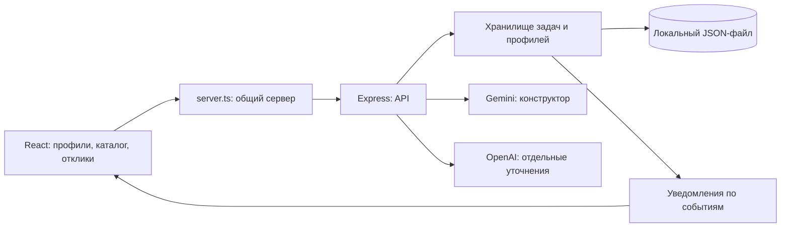

# Как устроен StartCard.ai

Один Node.js-процесс обслуживает интерфейс и API на одном порту. В разработке UI подключается через Vite; после сборки Express раздаёт `dist/`.

## Где искать изменения

| Область | Путь |
|---|---|
| Общий запуск UI + API | `server.ts` |
| Состояние интерфейса и навигация | `src/App.tsx` |
| Компоненты и формы | `src/components/` |
| Клиент запросов | `src/api.ts` |
| Типы интерфейса | `src/types/` |
| Обработчики API | `src/backend-app.js`, `src/routes/` |
| Настройка сервера и ключей | `src/server.js` |
| Хранение и запись снимков | `src/storage/` |
| Обращения к моделям и fallback | `src/services/` |
| Правила рейтинга | `src/utils/scoreCalculator.ts`, `src/domain/rating.js` |
| Проверки | `src/*.test.js` |

Структура участников сохранена: перенос всего проекта в новые каталоги `frontend/` и `backend/` для этих функций не требовался.

## Профили и события

ID профиля создаёт сервер; изменение имени не меняет связи с задачами и откликами. Бизнес-профиль владеет опубликованными им задачами. Профиль студента связан с его откликами. Выбор текущего профиля хранится в браузере, а данные профилей — на сервере.

Новый отклик создаёт уведомление владельцу задачи. Ручное принятие или отклонение создаёт уведомление студенту. Прочтение сохраняется вместе с событием. Клиент обновляет список периодически и при возвращении к вкладке; WebSocket и внешние рассылки не используются.

Это демо-профили без паролей: любой посетитель может выбрать существующий профиль. Фильтрация по профилю организует интерфейс, но не служит защитой доступа. Общий API также остаётся без авторизации.

## Данные и запуск

Обычный запуск сохраняет данные в `data/runtime/startcard.json`; путь меняется через `DATA_FILE`. Файл исключён из Git. Одна операция сохраняет согласованный снимок через временный файл и замену. Ошибка сохранения не должна выдаваться клиенту как успех, а повреждённый файл не должен незаметно сбрасываться.

Для временного сервера можно задать `DATA_FILE=:memory:`. В этом режиме данные исчезнут после перезапуска. Автотесты используют отдельные временные файлы или память, не пользовательское хранилище.

Файловое хранилище рассчитано на один процесс. На хостинге ему нужен постоянный диск; для нескольких серверов потребуется общая БД. API-ключи находятся только в окружении сервера и не включаются в клиентскую сборку.

## Совместимость

UI использует `/api/ui/*` и Gemini endpoints `/api/ai/*`. Исходные `/api/tasks` и OpenAI endpoints сохранены. UI и общий API пока имеют разные схемы контакта и правила рейтинга; их нельзя взаимозаменять без преобразования. Точный контракт — в [API](api-contract.md).
